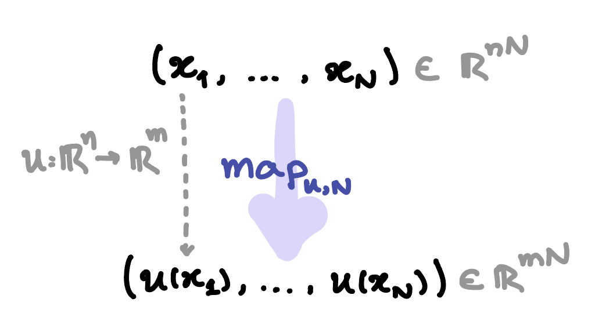
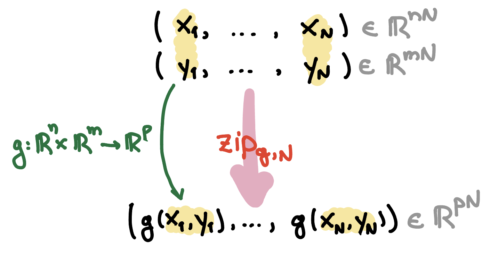

# Map/Zip Function Demo

This demo shows how to build loop-structured staged batched kernels with
`map_function(...)` and `zip_function(...)`, and how to compose them into a
single packed pipeline.

The unary base function is

$$u(x) =
\begin{bmatrix}
x_1^2 + \sin(x_2) \\
x_1 - 0.5 x_2
\end{bmatrix},$$

and the binary base function is

$$b(a, c) =
\begin{bmatrix}
a_1 + 2 c_1 \\
a_2 c_2 + \cos(a_1)
\end{bmatrix}.$$

### The map function 

For an integer $N$ (`count = N`), the **map** function (`map_function(u, N)`) consumes one packed sequence

$$x_{\mathrm{seq}} = (x^{(1)}, x^{(2)}, \dots, x^{(N)}),$$

and returns packed outputs

$$y_{\mathrm{seq}} = (u(x^{(1)}), u(x^{(2)}), \dots, u(x^{(N)})).$$

In other words, it is the mapping 

$$\mathrm{map}_{u, N}: x_{\mathrm{seq}} \mapsto y_{\mathrm{seq}}.$$

<p align="center">
  
</p>

### The zip function

Similarly, for an integer $M$, the **zip** function (`zip_function(b, N)`) consumes two packed sequences

$$a_{\mathrm{seq}} = (a^{(1)}, \dots, a^{(M)}), \qquad
c_{\mathrm{seq}} = (c^{(1)}, \dots, c^{(M)}),$$

and returns

$$z_{\mathrm{seq}} = (g(a^{(1)}, c^{(1)}), \dots, g(a^{(M)}, c^{(M)})).$$

In other words, it is the mapping 

$$\mathrm{zip}_{b, M}: a_{\mathrm{seq}} \mapsto b_{\mathrm{seq}}.$$

<p align="center">
  
</p>

### Map and zip

This demo computes a two-stage pipeline over packed sequences:

Firstly, map the unary kernel over both packed inputs, stage by stage:

$$\tilde{x}^{(k)} = u(x^{(k)}), \qquad
\tilde{c}^{(k)} = u(c^{(k)}), \qquad k = 1, \dots, N$$

Then, zip the binary kernel over those mapped stage pairs:

$$z^{(k)} = b\left(\tilde{x}^{(k)}, \tilde{c}^{(k)}\right), \qquad k = 1, \dots, N$$

So the packed output sequence is

$$z_{\mathrm{seq}} = \bigl(z^{(1)}, z^{(2)}, \dots, z^{(N)}\bigr),$$

equivalently

$$z_{\mathrm{seq}} = \mathrm{zip}_{b, N}\Bigl(\mathrm{map}_{u, N}(x_{\mathrm{seq}}),\ \mathrm{map}_{u, N}(c_{\mathrm{seq}})\Bigr).$$

## Files

- [`main.py`](./main.py): defines mapped/zipped staged functions and generates Rust
- `map_zip_kernel/`: generated by running `main.py`
- `runner/`: a small Rust binary crate that depends on `map_zip_kernel` by
  path, calls generated map/zip kernels, and prints their outputs

## Running the demo

It is advisable to run the demo from an activated virtual environment.

From the repository root, after activating your virtual environment:

```bash
python demos/map_zip/main.py
```

This will:

- evaluate mapped, zipped, and composed map+zip functions in Python
- evaluate Jacobians for zipped and composed functions in Python
- generate a Rust crate in:

```text
demos/map_zip/map_zip_kernel
```

To see how the generated crate can be used from Rust in practice, run:

```bash
cd demos/map_zip/runner
cargo run
```
